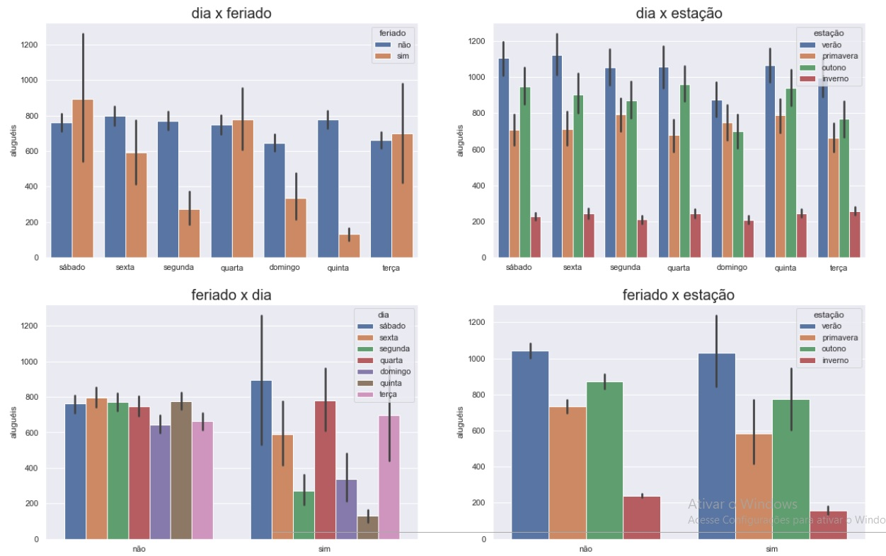
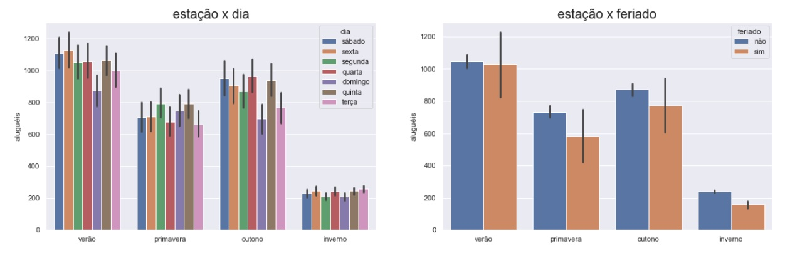

# 9ª COMPETIÇÃO DE MACHINE LEARNING FLAI 

## Detalhes técnicos:
- Dados de treinamento: (4500, 11) - variável resposta “aluguéis”. 
- Dados de teste: (3000, 10), não contém a variável resposta. 
- Métrica alvo: o modelo com o menor **RMSE**, vence!

## Problema 
Trata-se de um conjunto de dados para previsão da quantidade de aluguéis de bicicleta, regressão, a partir de variáveis do dia e do clima!
Submissão: cada pessoa pode enviar até 10 submissões, respeitando a data limite da competição. O ranking da competição será atualizado à medida em que novas submissões forem feitas. A única submissão que conta é a que tiver o melhor desempenho.

**Data limite de submissão: 19 de junho de 2022, às 20h.**

## Premiação em Vouchers para compras de livros na Amazon**:
- 1ª: Voucher de R$350.
- 2º: Voucher de R$120.
- 3º: Voucher de R$100.
- 4º: Voucher de R$80.
- 5º: Voucher de R$60.
- Melhor da Turma 9: Voucher de R$100

## Análise dos dados 

 

## Distribuição 
 

## Análise univariada

 
 

## Análise multivariada

 

 

 

## Minhas submissões

 
