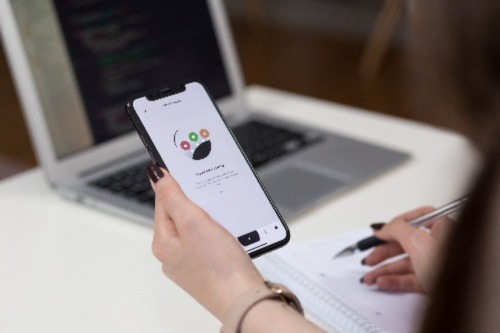

# Bem-vindo ao primeiro desafio de agrupamento não supervisionado do Kaggle!

A edição de agosto de 2022 da Tabular Playground Series é uma oportunidade para ajudar a empresa fictícia <b>Keep It Dry</b> a melhorar seu principal produto <b>Super Soaker</b> . O produto é usado em fábricas para absorver derramamentos e vazamentos.

A empresa acaba de concluir um grande estudo de teste para diferentes protótipos de produtos. Você pode usar esses dados para construir um modelo que prevê falhas do produto? 

Foto acima por [freestocks](https://unsplash.com/photos/ArH3dtoDQc0) no Unsplash.

## Avaliação

As submissões são avaliadas na área sob a [curva ROC](http://en.wikipedia.org/wiki/Receiver_operating_characteristic) entre a probabilidade prevista e o alvo observado.

 
 
